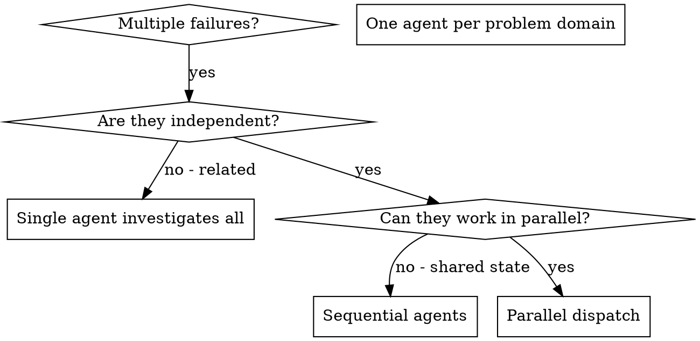

# 调度并行 Agent

## 概述

当你有多个不相关的失败（不同的测试文件、不同的子系统、不同的 bug）时，按顺序调查它们会浪费时间。每个调查都是独立的，可以并行进行。

**核心原则：** 每个独立问题域调度一个 agent。让它们并发工作。

## 何时使用



**适用场景：**
- 3个以上测试文件因不同根本原因失败
- 多个子系统独立损坏
- 每个问题可以在不了解其他问题背景的情况下理解
- 调查之间没有共享状态

**不适用场景：**
- 失败是相关的（修复一个可能修复其他）
- 需要了解完整系统状态
- Agent 会相互干扰

## 模式

### 1. 识别独立域

按损坏内容对失败分组：
- 文件 A 测试：工具审批流程
- 文件 B 测试：批处理完成行为
- 文件 C 测试：中止功能

每个域都是独立的——修复工具审批不影响中止测试。

### 2. 创建专注的 Agent 任务

每个 agent 获得：
- **具体范围：** 一个测试文件或子系统
- **明确目标：** 让这些测试通过
- **约束：** 不要更改其他代码
- **预期输出：** 你发现和修复内容的摘要

### 3. 并行调度

```typescript
// 在 Claude Code / AI 环境中
Task("修复 agent-tool-abort.test.ts 失败")
Task("修复 batch-completion-behavior.test.ts 失败")
Task("修复 tool-approval-race-conditions.test.ts 失败")
// 所有三个并发运行
```

### 4. 审查和整合

当 agent 返回时：
- 阅读每个摘要
- 验证修复不冲突
- 运行完整测试套件
- 整合所有更改

## Agent 提示结构

好的 agent 提示：
1. **专注** - 一个明确的问题域
2. **自包含** - 理解问题所需的所有背景
3. **输出明确** - agent 应该返回什么？

```markdown
修复 src/agents/agent-tool-abort.test.ts 中的 3 个失败测试：

1. "should abort tool with partial output capture" - 期望消息中有 'interrupted at'
2. "should handle mixed completed and aborted tools" - 快速工具被中止而不是完成
3. "should properly track pendingToolCount" - 期望 3 个结果但得到 0

这些是时序/竞态条件问题。你的任务：

1. 阅读测试文件，理解每个测试验证什么
2. 识别根本原因 - 是时序问题还是实际的 bug？
3. 通过以下方式修复：
   - 用基于事件的等待替换任意超时
   - 如果发现 abort 实现中的 bug 则修复
   - 如果测试期望的行为已更改则调整测试期望

不要只是增加超时 - 找到真正的问题。

返回：你发现的问题和你修复的内容摘要。
```

## 常见错误

**❌ 太宽泛：** "修复所有测试" - agent 会迷失方向
**✅ 具体：** "修复 agent-tool-abort.test.ts" - 专注的范围

**❌ 没有背景：** "修复竞态条件" - agent 不知道在哪里
**✅ 有背景：** 粘贴错误消息和测试名称

**❌ 没有约束：** Agent 可能重构所有内容
**✅ 有约束：** "不要更改生产代码" 或 "只修复测试"

**❌ 输出模糊：** "修复它" - 你不知道改了什么
**✅ 输出明确：** "返回根本原因和更改的摘要"

## 何时不使用

**相关的失败：** 修复一个可能修复其他——先一起调查
**需要完整背景：** 理解需要查看整个系统
**探索性调试：** 你还不知道什么坏了
**共享状态：** Agent 会相互干扰（编辑相同文件，使用相同资源）

## 会话中的真实示例

**场景：** 重大重构后 3 个文件中有 6 个测试失败

**失败：**
- agent-tool-abort.test.ts: 3 个失败（时序问题）
- batch-completion-behavior.test.ts: 2 个失败（工具未执行）
- tool-approval-race-conditions.test.ts: 1 个失败（执行计数 = 0）

**决策：** 独立域 - 中止逻辑与批处理完成与竞态条件分别独立

**调度：**
```
Agent 1 → 修复 agent-tool-abort.test.ts
Agent 2 → 修复 batch-completion-behavior.test.ts
Agent 3 → 修复 tool-approval-race-conditions.test.ts
```

**结果：**
- Agent 1: 用基于事件的等待替换超时
- Agent 2: 修复事件结构 bug（threadId 在错误位置）
- Agent 3: 添加等待异步工具执行完成

**整合：** 所有修复独立，无冲突，完整套件绿色

**节省时间：** 3 个问题并行解决而非顺序解决

## 核心优势

1. **并行化** - 多个调查同时进行
2. **专注** - 每个 agent 范围狭窄，需要跟踪的背景更少
3. **独立性** - Agent 不相互干扰
4. **速度** - 在 1 个问题的时间内解决 3 个问题

## 验证

在 agent 返回后：
1. **审查每个摘要** - 理解更改了什么
2. **检查冲突** - Agent 是否编辑了相同代码？
3. **运行完整套件** - 验证所有修复一起工作
4. **抽查** - Agent 可能犯系统性错误

## 现实影响

来自调试会话（2025-10-03）：
- 3 个文件中有 6 个失败
- 并行调度 3 个 agent
- 所有调查并发完成
- 所有修复成功整合
- Agent 更改之间零冲突
