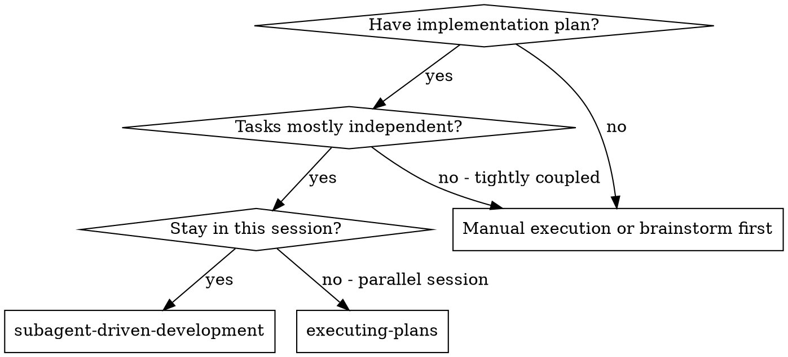
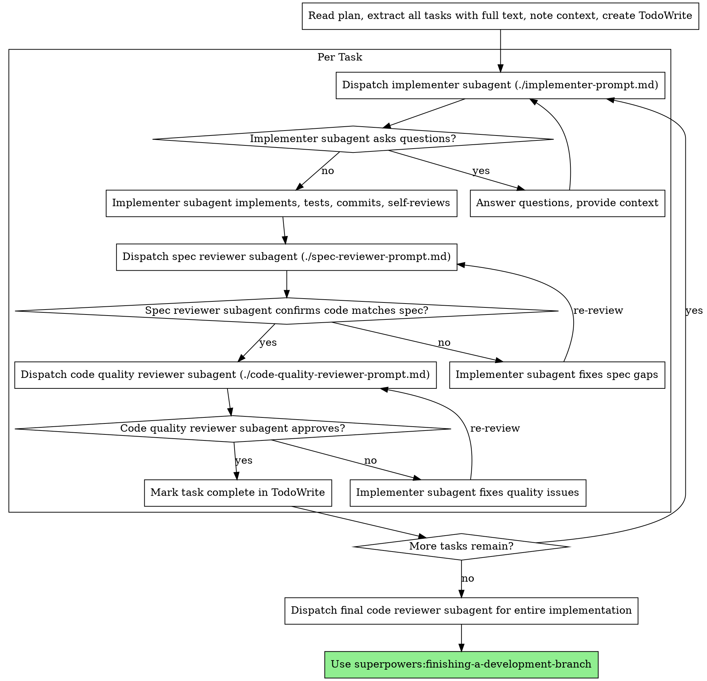

# 子 agent 驱动开发

通过为每个任务调度新子 agent 来执行计划，每个任务后有两阶段审查：首先是规格合规性审查，然后是代码质量审查。

**核心原则：** 每个任务新子 agent + 两阶段审查（先规格后质量）= 高质量，快速迭代

## 何时使用



**对比执行计划（并行会话）：**
- 同一会话（无上下文切换）
- 每个任务新子 agent（无上下文污染）
- 每个任务后两阶段审查：先规格合规性，然后代码质量
- 更快迭代（任务间无人工介入）

## 流程



## 提示模板

- `./implementer-prompt.md` - 调度实现者子 agent
- `./spec-reviewer-prompt.md` - 调度规格合规性审查者子 agent
- `./code-quality-reviewer-prompt.md` - 调度代码质量审查者子 agent

## 示例工作流

```
你：我正在使用子 agent 驱动开发来执行这个计划。

[读取计划文件一次：docs/plans/feature-plan.md]
[提取所有 5 个任务的完整文本和背景]
[创建包含所有任务的 TodoWrite]

任务 1：Hook 安装脚本

[获取任务 1 文本和背景（已提取）]
[用完整任务文本 + 背景调度实现子 agent]

实现者："开始之前 - hook 应该安装在用户级还是系统级？"

你："用户级（~/.config/superpowers/hooks/）"

实现者："明白了。现在实现..."
[稍后] 实现者：
  - 实现了 install-hook 命令
  - 添加了测试，5/5 通过
  - 自我审查：发现我漏掉了 --force 标志，已添加
  - 已提交

[调度规格合规性审查者]
规格审查者：✅ 规格合规 - 满足所有要求，没有额外内容

[获取 git SHA，调度代码质量审查者]
代码审查者：优势：良好的测试覆盖率，干净。问题：无。批准。

[标记任务 1 完成]

任务 2：恢复模式

[获取任务 2 文本和背景（已提取）]
[用完整任务文本 + 背景调度实现子 agent]

实现者：[没有问题，继续]
实现者：
  - 添加了 verify/repair 模式
  - 8/8 测试通过
  - 自我审查：一切良好
  - 已提交

[调度规格合规性审查者]
规格审查者：❌ 问题：
  - 缺少：进度报告（规格说"每 100 项报告一次"）
  - 额外：添加了 --json 标志（未请求）

[实现者修复问题]
实现者：删除了 --json 标志，添加了进度报告

[规格审查者再次审查]
规格审查者：✅ 现在规格合规

[调度代码质量审查者]
代码审查者：优势：扎实。问题（重要）：魔法数字（100）

[实现者修复]
实现者：提取了 PROGRESS_INTERVAL 常量

[代码审查者再次审查]
代码审查者：✅ 批准

[标记任务 2 完成]

...

[所有任务完成后]
[调度最终代码审查者]
最终审查者：满足所有要求，准备合并

完成！
```

## 优势

**对比手动执行：**
- 子 agent 自然遵循 TDD
- 每个任务新上下文（无混淆）
- 并行安全（子 agent 不干扰）
- 子 agent 可以提问（工作前后）

**对比执行计划：**
- 同一会话（无交接）
- 持续进展（无需等待）
- 自动审查检查点

**效率提升：**
- 无文件读取开销（控制器提供完整文本）
- 控制器精确策划所需背景
- 子 agent 前期获得完整信息
- 问题在工作开始前浮现（而非之后）

**质量门控：**
- 自我审查在交接前捕获问题
- 两阶段审查：规格合规性，然后代码质量
- 审查循环确保修复真正有效
- 规格合规性防止过度/不足构建
- 代码质量确保实现构建良好

**成本：**
- 更多子 agent 调用（每个任务实现者 + 2 个审查者）
- 控制器做更多准备工作（前期提取所有任务）
- 审查循环增加迭代
- 但早期捕获问题（比以后调试更便宜）

## 危险信号

**永远不要：**
- 未经用户明确同意在 main/master 分支上开始实现
- 跳过审查（规格合规性或代码质量）
- 有未修复问题时继续
- 并行调度多个实现子 agent（冲突）
- 让子 agent 读取计划文件（改为提供完整文本）
- 跳过场景设置背景（子 agent 需要理解任务位置）
- 忽略子 agent 问题（在让他们继续之前回答）
- 对规格合规性接受"差不多"（规格审查者发现问题 = 没完成）
- 跳过审查循环（审查者发现问题 = 实现者修复 = 再次审查）
- 让实现者自我审查替代实际审查（两者都需要）
- **在规格合规性 ✅ 之前开始代码质量审查**（顺序错误）
- 在任一审查有未解决问题时移动到下一个任务

**如果子 agent 提问：**
- 清晰完整地回答
- 如果需要提供额外背景
- 不要催促他们进入实现

**如果审查者发现问题：**
- 实现者（同一子 agent）修复它们
- 审查者再次审查
- 重复直到批准
- 不要跳过重新审查

**如果子 agent 任务失败：**
- 用具体指令调度修复子 agent
- 不要尝试手动修复（上下文污染）

## 整合

**必需的工作流技能：**
- **superpowers:using-git-worktrees** - 必需：开始前设置隔离工作区
- **superpowers:writing-plans** - 创建此技能执行的计划
- **superpowers:requesting-code-review** - 审查者子 agent 的代码审查模板
- **superpowers:finishing-a-development-branch** - 所有任务完成后完成开发

**子 agent 应该使用：**
- **superpowers:test-driven-development** - 子 agent 对每个任务遵循 TDD

**替代工作流：**
- **superpowers:executing-plans** - 用于并行会话而非同一会话执行
