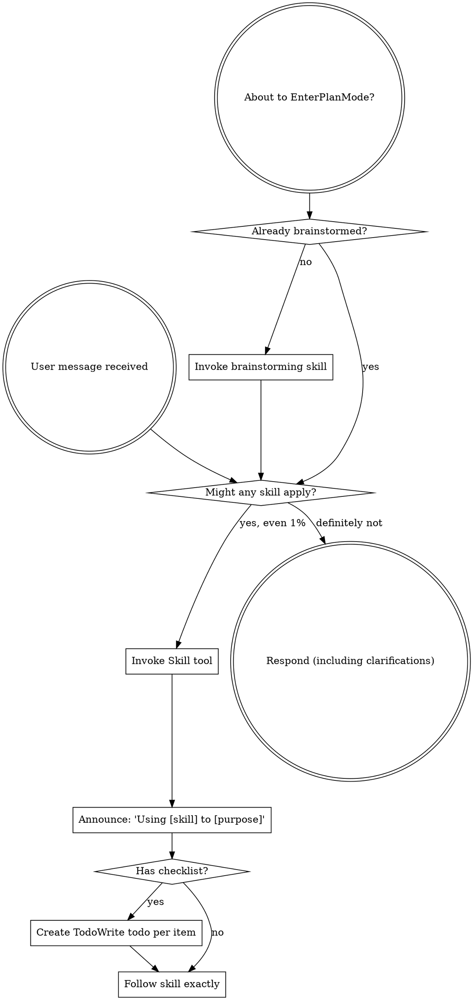

<极其重要>
如果你认为有哪怕 1% 的可能性某个技能可能适用于你正在做的事情，你绝对必须调用该技能。

如果技能适用于你的任务，你没有选择。你必须使用它。

这不可协商。这不是可选的。你无法合理化你的方式逃避这个。
</极其重要>

## 如何访问技能

**在 Claude Code 中：** 使用 `Skill` 工具。当你调用技能时，其内容被加载并呈现给你——直接遵循它。永远不要对技能文件使用 Read 工具。

**在其他环境中：** 查看你平台的文档了解技能如何加载。

# 使用技能

## 规则

**在任何响应或行动之前调用相关或请求的技能。** 即使只有 1% 的可能性技能可能适用，你也应该调用技能来检查。如果调用的技能结果证明不适合该情况，你不需要使用它。

## 危险信号

这些想法意味着停止——你在合理化：

| 想法 | 现实 |
|------|------|
| "这只是一个简单的问题" | 问题是任务。检查技能。 |
| "我先需要更多背景" | 技能检查在澄清问题之前。 |
| "让我先探索代码库" | 技能告诉你如何探索。先检查。 |
| "我可以快速检查 git/文件" | 文件缺少对话背景。检查技能。 |
| "让我先收集信息" | 技能告诉你如何收集信息。 |
| "这不需要正式技能" | 如果技能存在，使用它。 |
| "我记得这个技能" | 技能演变。阅读当前版本。 |
| "这不算任务" | 行动 = 任务。检查技能。 |
| "技能是过度杀伤" | 简单的事情变复杂。使用它。 |
| "我只先做这一件事" | 在做任何事之前检查。 |
| "这感觉高效" | 不受纪律的行动浪费时间。技能防止这个。 |
| "我知道那意味着什么" | 知道概念 ≠ 使用技能。调用它。 |

## 技能优先级

当多个技能可能适用时，使用此顺序：

1. **流程技能优先**（brainstorming、debugging）- 这些决定如何接近任务
2. **实现技能其次**（frontend-design、mcp-builder）- 这些指导执行

"让我们构建 X" → 先 brainstorming，然后实现技能。
"修复这个 bug" → 先 debugging，然后特定领域技能。

## 技能类型

**严格的**（TDD、debugging）：精确遵循。不要适应掉纪律。

**灵活的**（patterns）：根据背景适应原则。

技能本身告诉你哪个。

## 用户指令

指令说什么，不说如何。"添加 X" 或 "修复 Y" 不意味着跳过工作流。
